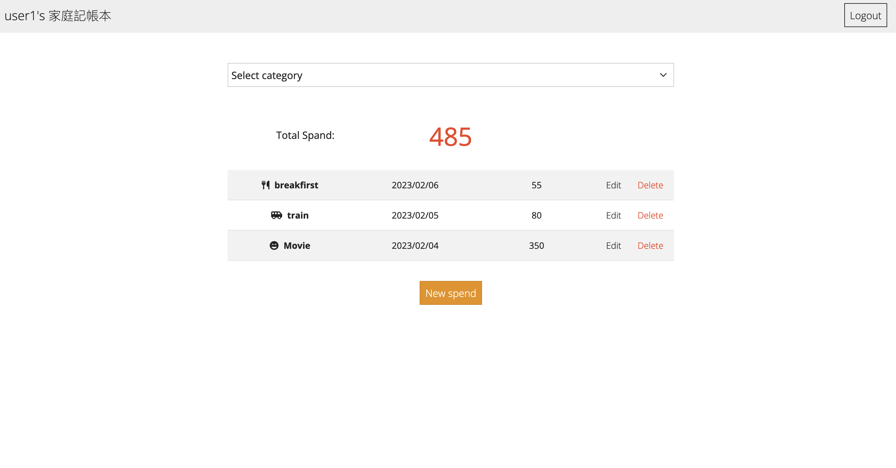

# Ｅxpense Tracker

This project provide user can search restaurant list by name or category.

## Table of contents

- [Overview](#Overview)
- [Screenshot](#Screenshot)
- [Installation](#Installation)
- [Built with](#built-with)
- [Author](#author)

## Overview

Users should be able to:


- View total expense on home page.
- View all expenses or view by category.
- Can create or edit each expense.

#Screenshot


## Installation

1. Before start, make sure you already install Express and npm
```
git clone https://github.com/qweb321/Expense-tracker
```
2. In local side, run npm install
3. After installation finished, run
```
npm run start
```
4. If terminal show the sentence below, means run successfully and click the url
```
app is listening in http://localhost:3000/users/login
```
5. If you want to stop
```
ctrl + C
```

## Built with

- Node.js
- Express
- Express-Handlebars
- MongoDB
- Mongoose
- Javascript
- CSS


## Author

- Website - [Isis Lin](https://github.com/qweb321)
